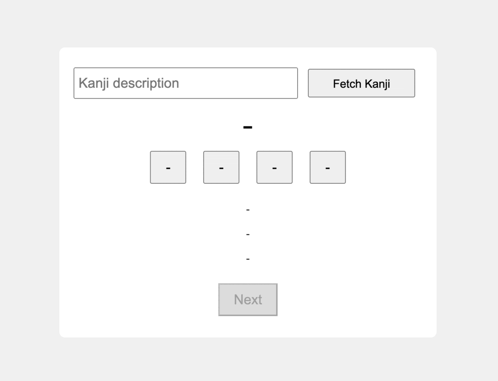

# kanji-flashcard-app-gpt4

A Japanese Kanji Flashcard App built using Python and Langchain, enhanced with the intelligence of GPT-4.



For a detailed walkthrough of how this app was built, check out the accompanying blog post: [https://adilmoujahid.com/posts/2023/10/kanji-gpt4/](https://adilmoujahid.com/posts/2023/10/kanji-gpt4/).

## Prerequisites

- The app has been tested with **Python 3.9**.
- Obtain an API key from OpenAI and include it in `config.py`.

## Installation

1. First, install the required dependencies:
   ```bash
   pip install -r requirements.txt
   ```

2. Ensure your OpenAI API key is added to `config.py`.

## Running the App

After setting up, simply run the following command from your terminal:

```bash
python app.py
```

Then, open up your browser and navigate to: http://127.0.0.1:5000


Enjoy learning Kanji with the power of GPT-4! 📚🇯🇵🤖
